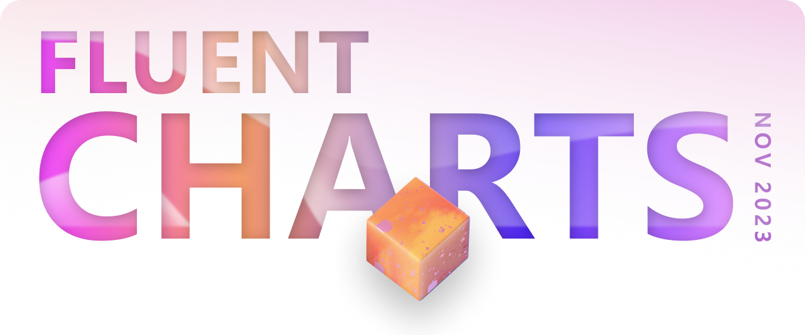
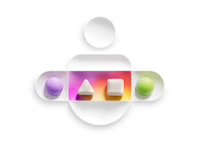
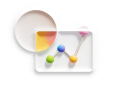
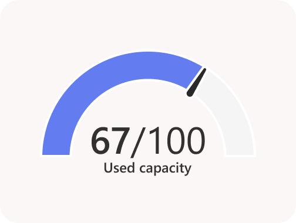
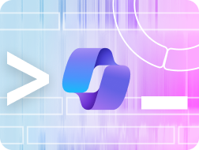

Fluent UI React charts is built using D3 (Data Driven Documents) and other fluent UI controls. Available in both V7 and V8, these charts are ready to be used in a production environment. Come check them out on our doc site today!

<!-- truncate -->

## Good data visualization transforms raw data into a visual form that is interpretable, delightful, and triggers insight.
 
As an industry leader with a comprehensive portfolio of data-driven products, Microsoft is uniquely positioned to distill the best standards, research, tools, and techniques into a data visualization toolkit that is truly One Microsoft. The goal of our new charting library is to produce a consistent and inclusive experience for customers across our platforms.
 
## Charts now available in Fluent docsite
Fluent UI React charts is built using D3 (Data Driven Documents) and other fluent UI controls. Available in both V7 and V8, these charts are ready to be used in a production environment. Come check them out on our doc site today!

<table>
<tr style={{border:"0"}}>
<td style={{border:"0", verticalAlign:"top"}}>

### Community driven 
Charting library is built as a community driven project. There are extensive tests and guidance docs to ensure quality and collaborative development. The team is committed to help partners build their scenarios. Recent partner contributions include secondary y-axis and donut chart default colors..
 
</td>
<td style={{border:"0", verticalAlign:"top"}}>

### Built in accessibility
With design and dev working hand in hand, our data viz library has considered accessibility from day one. Our library is WCAG MAS C compliant, with built in accessible practices for easy implementation that can craft the best experience for everyone, everywhere.

</td>
</tr>
</table>

## What’s new

<table>
<tr style={{border:"0"}}>
<td style={{border:"0", verticalAlign:"top"}}>

### New chart available
We’re actively building out the library based on the needs of the teams consuming it. The latest addition to our library is the gauge chart, which came from a partner request.

</td>
<td style={{border:"0", verticalAlign:"top"}}>

### Fluent Charting controls in M365 copilot
As part of this year’s Hackathon, we enabled charting controls in the admin copilot centro control. By allowing users to naturally interact with copilot, we can intelligently determine when a visualization would help them better understand the data. View the project
Coming soon

</td>
</tr>
</table>

 

## V9 data viz updates
We’re hard at work on the next version of Fluent data viz V9! Upcoming features will include a new gradient color palette, variable rounded corners and much more. We would love to hear what do you think! Complete this short survey and share your thoughts. Take the survey.

## Community news 
What our partners are saying 
The library is currently in use by teams across Microsoft with primary consumers being MAC (Microsoft admin center), Azure core trusted platform, Viva learning and Viva Amplify, Defender and many more.
 
## Power Automate Team
“We are happy with the result, and we are still developing new tabs for adding more data and more charts. The collaboration we have with your team is excellent and the work you are doing to unblock us is amazing!“
 
## Contribute to the library
Are you interested to contribute to our Open Source initiative? Check this out.
Resources
 
## Toolkit and guidance
We’ve created a UI kit along with guidance to help you understand which chart to use for your use case and all your component needs. Powered by an extensive v-team and Fluent partnership.
 
## Office hours
We are here to help. If you have any questions, concerns or just want to chat about data viz, join us for our weekly office hours. Sign up the sheet and we will send you more information.
We’re always looking for feedback, chart requests, new v-team members, and the chance to help you onboard to the library. We look forward to hearing from you!
